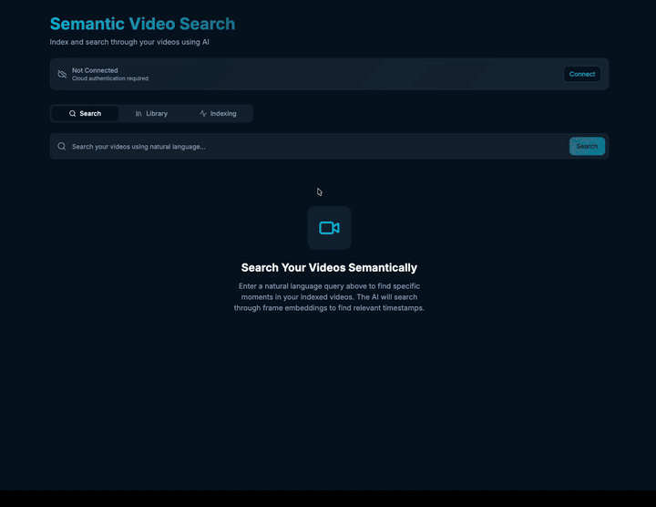
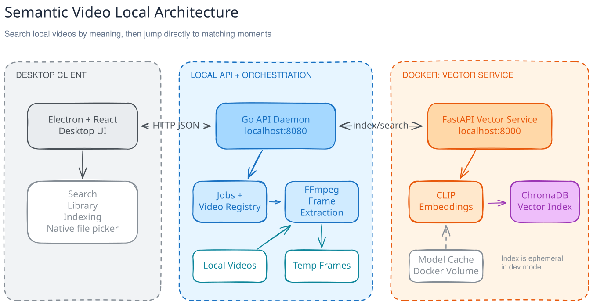

# Semantic Video

A desktop app for searching your local videos with natural language. Add a video or folder, let the app index it, then describe what you want to find and jump directly to the matching moments.

## Demo



## Run locally

[Docker Desktop](https://www.docker.com/products/docker-desktop/) must be installed manually and opened once. The remaining setup is automated on macOS; the script skips tools and dependencies that are already installed, and it is safe to run again.

```bash
./scripts/setup.sh
./scripts/dev.sh
```

`dev.sh` starts the vector service, Go API, and Electron client in the correct order. Press `Ctrl-C` to stop the services it started.

To inspect setup without changing your computer, or to verify an existing installation:

```bash
./scripts/setup.sh --dry-run
./scripts/setup.sh --check
```

## Test

Run the environment checks, Go tests, and client production build together:

```bash
./scripts/test.sh
```

## Architecture



Editable source: [`assets/semantic-video-architecture.excalidraw`](assets/semantic-video-architecture.excalidraw)

- The Electron and React client provides the desktop interface and native file and folder pickers. Vite serves it at `http://localhost:5173` during development.
- The Go API manages videos, extracts frames with FFmpeg, and streams video files. Its API and Swagger UI are available at `http://localhost:8080` and `http://localhost:8080/swagger`.
- The Python vector service generates CLIP embeddings and searches ChromaDB. It runs in Docker at `http://localhost:8000`.

The client talks to the Go API, which proxies indexing and search operations to the vector service. Development runs are stateless by default, so indexed data and extracted frames are cleaned up when the services stop; the downloaded embedding model remains cached in a Docker volume.
